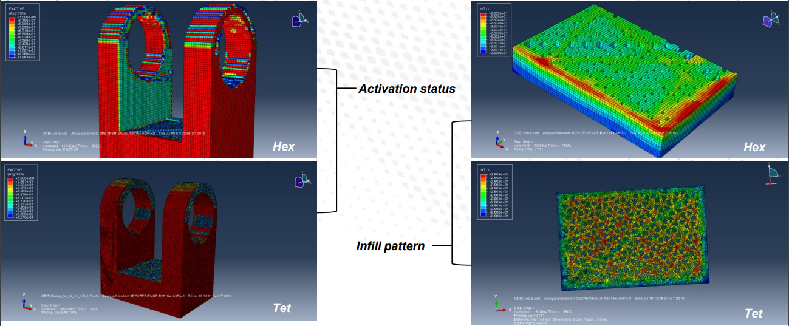
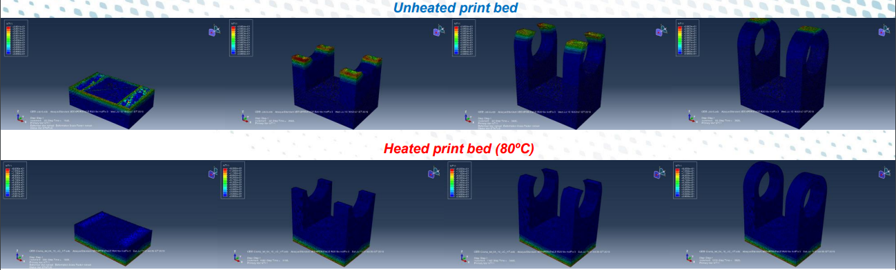
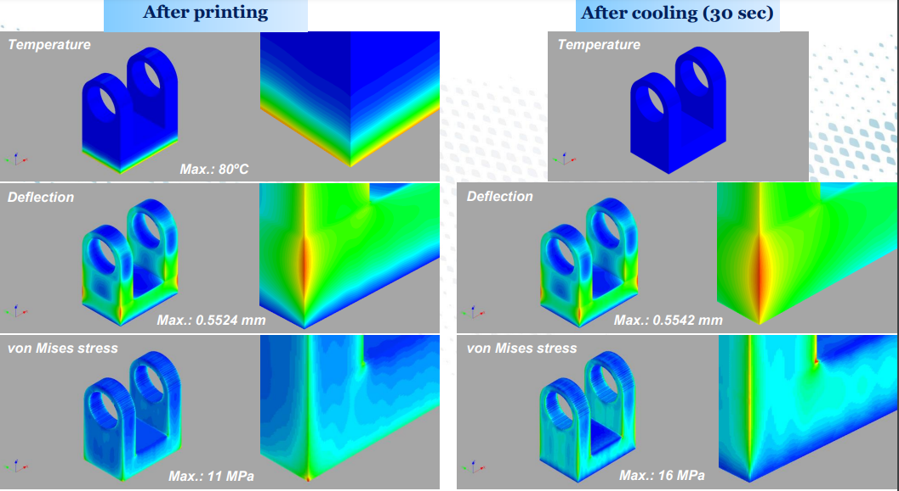

<h1 align="center">Internship project at Airbus</h1>

**Company:** Airbus India Pvt. Ltd.

**Location:** Bengaluru, India

**Duration:** May 2019 - Jul 2019

**Role:** Airframe Research & Technology Intern

---

***Project objective:*** *Thermo-mechanical modeling and simulation of Additive Manufacturing (AM) processes*

**My contributions:**
* Was the only intern selected by Airbus from IIT Kharagpur
* Laid the foundation of a novel simulation method in Airbus to mitigate the defects of thermal distortions and residual stresses in
plastic AM parts by performing sequential thermal-structural analyses in ABAQUS based on the Progressive Element Activation
algorithm
* Created a Python script to interpret and convert the 3D printer’s GCode into ABAQUS readable event series format
* Performed sensitivity analyses taking into account parameters like element type, element size, time step, constitutive material
model, partial/full activation, print bed/chamber temp., infill pattern, etc.
* Work was commended by Airbus Germany’s ECG team, and Colin Smart, Airbus airworthiness and certification expert
* Received the “Drive Improvement and Innovation award” for the innovative and exemplary work performed in a short time frame

  

  

  

